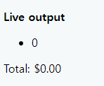
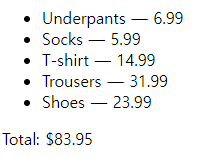

## 상품들 출력하기

[mdn/Arrays](https://developer.mozilla.org/ko/docs/Learn/JavaScript/First_steps/Arrays)

예제 코드:  


```javascript
var list = document.querySelector(".output ul");
var totalBox = document.querySelector(".output p");
var total = 0;
list.innerHTML = "";
totalBox.textContent = "";
// number 1
("Underpants:6.99");
("Socks:5.99");
("T-shirt:14.99");
("Trousers:31.99");
("Shoes:23.99");

for (var i = 0; i <= 0; i++) { // number 2
  // number 3

  // number 4

  // number 5
  itemText = 0;

  var listItem = document.createElement("li");
  listItem.textContent = itemText;
  list.appendChild(listItem);
}

totalBox.textContent = "Total: $" + total.toFixed(2);
```

1. 각 문자열은 상품의 이름과 가격을 포함하고 있고 콜론에 의해 분리되어 있음. 이것을 products라는 배열으로 바꾸고 이곳에 문자열을 저장하기.

```javascript
// number 1
const products = [
  "Underpants:6.99",
  "Socks:5.99",
  "T-shirt:14.99",
  "Trousers:31.99",
  "Shoes:23.99",
];
```

2. i가 products배열의 길이(length)보다 더 이상 작지 않을 때 반복을 멈추게 하는 조건 테스트로 바꾸기.

```javascript
for (let i = 0; i < products.length; i++) { // number 2
}
```

1. // number 3 주석 바로 아래에서 현재 배열의 원소를, 한 개는 단순히 이름을 포함하고 한 개는 단순히 가격을 포함하는 두 개의 원소로 분리하는 한 줄의 코드를 작성하기.

```javascript
for (let i = 0; i < products.length; i++) { // number 2
  // number 3
  const productsArr = products[i].split(":");
  const name = productsArr[0];
  const price = productsArr[1];
}
```

4. 가격을 문자열에서 숫자로 전환하기.

```javascript
// number 4
const price = Number(productsArr[1]);
console.log(typeof price);
```

5. 0의 값이 주어진 total이라는 변수가 for문 밖에 있고, 현재 상품의 가격을 반복문의 각 반복마다 총액(total)에 합하는 코드 한 줄을 추가한 후 출력되도록 작성하기.

```javascript
total += price;
```

6. itemText 변수가 "current item name — $current item price"와 같이 만들어지도록, 예를 들자면 각각의 경우에 "Shoes — $23.99" 처럼 만들어지도록 작성하기.

```javascript
itemText = `${name} — ${price}`;
```

완성코드:  


```javascript
const list = document.querySelector(".output ul");
const totalBox = document.querySelector(".output p");
let total = 0;
list.innerHTML = "";
totalBox.textContent = "";
// number 1
const products = [
  "Underpants:6.99",
  "Socks:5.99",
  "T-shirt:14.99",
  "Trousers:31.99",
  "Shoes:23.99",
];

for (let i = 0; i < products.length; i++) { // number 2
  // number 3
  const productsArr = products[i].split(":");
  const name = productsArr[0];
  const price = Number(productsArr[1]);
  // number 4

  // number 5
  total += price;
  itemText = `${name} — ${price}`;

  const listItem = document.createElement("li");
  listItem.textContent = itemText;
  list.appendChild(listItem);
}

totalBox.textContent = "Total: $" + total.toFixed(2);
```
